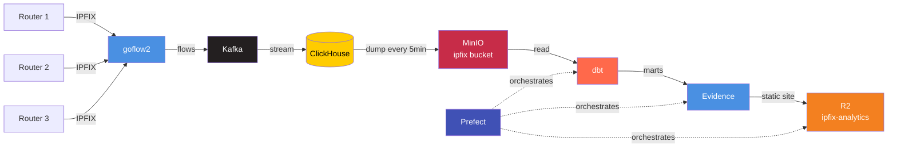

# IPFIX Analytics

Network flow analytics pipeline that processes IPFIX data through ClickHouse, transforms it with dbt, and publishes interactive dashboards to Cloudflare R2.

## Architecture



## Pipeline Stages

**Data Collection**
- Network routers export IPFIX flows
- goflow2 collector receives and normalizes flows
- Kafka buffers the stream
- ClickHouse stores raw flow data

**Data Export**
- ClickHouse dumps to MinIO bucket every 5 minutes
- Parquet files stored in `s3://ipfix/`

**Analytics Layer**
- dbt reads from MinIO, creates staging models
- Mart models aggregate traffic patterns, top talkers, protocols, ports
- Output written to local DuckDB

**Visualization**
- Evidence runs queries against DuckDB
- Builds static dashboard site
- Prefect orchestrates: dbt → Evidence sources → Evidence build → R2 deploy

## Running the Pipeline

```bash
python ipfix_pipeline.py
```

The Prefect flow executes:
1. `dbt build` - materialize all models
2. `npm run sources` - refresh Evidence queries
3. `npm run build` - build static site
4. `rclone copy` - deploy to R2

## Setup

**Requirements**
- Python 3.x with Prefect
- dbt-core with dbt-duckdb
- Node.js with Evidence.dev
- rclone configured with R2 remote

**Configuration**
- dbt profiles: `dbt/profiles.yml`
- Evidence sources: `evidence/sources/`
- rclone remote: `r2:ipfix-analytics`

## Project Structure

```
.
├── dbt/                  # dbt project
│   ├── models/
│   │   ├── staging/     # source data from MinIO
│   │   └── marts/       # analytics models
│   └── profiles.yml
├── evidence/            # Evidence dashboard
│   ├── pages/          # dashboard pages
│   ├── sources/        # SQL queries
│   └── build/          # static output
└── ipfix_pipeline.py   # Prefect orchestration
```
